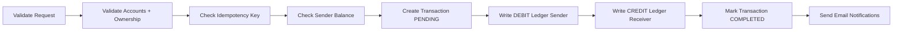

# Bank Transaction System

A Node.js + Express + MongoDB backend for account management, secure authentication, and ledger-based money transfers.

This project is designed to be educational as well as practical: it demonstrates transaction workflows, idempotency keys, balance derivation from ledger entries, and email notifications.

## Why This Project

Most beginner banking demos store `balance` directly on an account and mutate it in place. This system takes a more audit-friendly approach:

- All money movement is recorded in immutable ledger entries.
- Account balance is derived from ledger history.
- Transfers use an `idempotencyKey` to avoid duplicate processing.
- JWT auth + token blacklist supports login/logout flows.

Balance formula:

```text
balance = totalCredit - totalDebit
```

## Features

- User registration, login, and logout
- JWT-based authorization middleware
- One-account-per-user creation flow
- Account balance calculation from ledger entries
- Transfer creation with sender and receiver ledgers
- System-only initial funding endpoint
- Transaction status handling: `PENDING`, `COMPLETED`, `FAILED`, `REVERSED`
- Transaction and registration email notifications

## Tech Stack

- Runtime: Node.js
- Framework: Express
- Database: MongoDB + Mongoose
- Auth: JSON Web Tokens (JWT)
- Security: bcrypt password hashing
- Email: Nodemailer (Gmail OAuth2)
- Cookies: cookie-parser

## Project Structure

```text
.
|-- server.js
|-- src
|   |-- app.js
|   |-- config
|   |   `-- connection.js
|   |-- controllers
|   |   |-- account.controller.js
|   |   |-- auth.controller.js
|   |   `-- transaction.controller.js
|   |-- middlewares
|   |   `-- auth.middleware.js
|   |-- models
|   |   |-- account.model.js
|   |   |-- blackList.model.js
|   |   |-- ledger.model.js
|   |   |-- transaction.model.js
|   |   `-- user.model.js
|   |-- routes
|   |   |-- account.route.js
|   |   |-- auth.route.js
|   |   `-- transaction.route.js
|   `-- services
|       `-- email.service.js
`-- package.json
```

## Quick Start

### 1) Clone and install

```bash
git clone https://github.com/MuhammadSaadEhsan/Bank-Transaction-System---Node-js.git
cd Bank-Transaction-System
npm install
```

### 2) Create environment file

Create a `.env` file in the project root:

```env
# Server
port=3000

# Database
MONGO_URI=mongodb://127.0.0.1:27017/bank_transaction_system

# Auth
JWT_SECRET=your_super_secret_key

# Email (Gmail OAuth2)
EMAIL_USER=your-email@gmail.com
CLIENT_ID=your-google-client-id
CLIENT_SECRET=your-google-client-secret
REFRESH_TOKEN=your-google-refresh-token

# Optional
SUPPORT_EMAIL=support@example.com
FRONTEND_URL=http://localhost:5173
```

### 3) Run the app

```bash
npm run dev
```

Server starts from `server.js` and uses:

- `connectToDatabase()` from `src/config/connection.js`
- Express app from `src/app.js`

## API Overview

Base URL:

```text
http://localhost:3000
```

### Auth

#### POST /api/auth/register
Create a new user and returns JWT.

Request body:

```json
{
  "name": "Alice",
  "email": "alice@example.com",
  "password": "password123"
}
```

#### POST /api/auth/login
Authenticate user and returns JWT.

Request body:

```json
{
  "email": "alice@example.com",
  "password": "password123"
}
```

#### POST /api/auth/logout
Blacklists the current token and clears cookie.

Auth:

- Cookie token, or
- `Authorization: Bearer <token>`

### Accounts

All account routes require auth middleware.

#### POST /api/accounts
Create an account for logged-in user.

#### GET /api/accounts
Get all accounts belonging to logged-in user.

#### GET /api/accounts/balance/:accountId
Get current derived balance of an account.

### Transactions

All transaction routes require auth middleware.

#### POST /api/transaction
Create transfer from one account to another.

Request body:

```json
{
  "fromAccount": "<senderAccountId>",
  "toAccount": "<receiverAccountId>",
  "amount": 100,
  "idempotencyKey": "tx-001-unique-key"
}
```

Behavior:

- Validates sender ownership and account status.
- Validates sender has sufficient balance.
- Creates:
  - DEBIT ledger on sender account
  - CREDIT ledger on receiver account
- Marks transaction `COMPLETED` on success.

#### POST /api/transaction/system/initial-funds
Create initial fund transfer (system user only).

## Request Auth Examples

Using bearer token:

```bash
curl -X GET http://localhost:3000/api/accounts \
  -H "Authorization: Bearer <token>"
```

Create transaction:

```bash
curl -X POST http://localhost:3000/api/transaction \
  -H "Content-Type: application/json" \
  -H "Authorization: Bearer <token>" \
  -d '{
    "fromAccount":"<senderAccountId>",
    "toAccount":"<receiverAccountId>",
    "amount":100,
    "idempotencyKey":"tx-001-unique-key"
  }'
```

## Data Model Summary

- User
  - name, email, password (hashed), systemUser
- Account
  - user, status (`ACTIVE | FROZEN | CLOSED`), currency
- Transaction
  - fromAccount, toAccount, amount, status, idempotencyKey
- Ledger
  - account, transaction, amount, type (`DEBIT | CREDIT`)
- Token Blacklist
  - token with TTL index (3 days)

## Transaction Lifecycle



## Learning Notes

If you are studying backend architecture, this repo is a good place to practice:

- Controller-service separation improvements
- Better transaction error handling and rollback patterns
- Input validation with schema libraries (Joi/Zod)
- Automated tests for auth and transfer flows
- OpenAPI/Swagger docs generation

## Scripts

```bash
npm run dev    # start with nodemon
npm start      # start with node
npm test       # placeholder
```

## Troubleshooting

### MongoDB connection issues
- Verify `MONGO_URI` in `.env`.
- Ensure MongoDB is running locally or reachable remotely.

### Unauthorized errors
- Confirm token is present in cookie or `Authorization` header.
- Ensure token is not blacklisted after logout.

### Email not sending
- Recheck Gmail OAuth2 credentials in `.env`.
- Confirm `EMAIL_USER` matches OAuth app setup.

## Contribution Guide

1. Fork and clone the repository.
2. Create a feature branch.
3. Make focused changes with clear commits.
4. Test your endpoints locally.
5. Open a pull request with a concise summary.

## License

ISC
